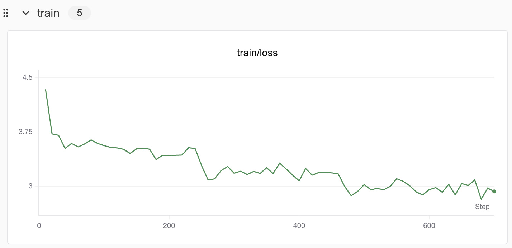

# 01-ERNIE-4.5-0.3B-PT Lora 微调及 SwanLab 可视化记录

本节我们简要介绍如何基于 transformers、peft 等框架，使用由笔者合作开源的 [Chat-甄嬛](https://github.com/KMnO4-zx/huanhuan-chat) 项目中的**嬛嬛数据集**作为微调数据集，对 ERNIE-4.5-0.3B-PT 模型进行 LoRA 微调, 以构建一个能够模拟甄嬛对话风格的个性化 LLM , 数据集路径为[`../../dataset/huanhuan.json`](../../dataset/huanhuan.json)。同时使用 [SwanLab](https://github.com/swanhubx/swanlab) 监控训练过程与评估模型效果。


> **LoRA** 是一种高效微调方法，深入了解其原理可参见博客：[知乎|深入浅出 LoRA](https://zhuanlan.zhihu.com/p/650197598)。

> 本教程会在同目录下给大家提供一个 [**notebook 文件** ERNIE-4.5-0.3B-PT Lora 微调及 SwanLab 可视化记录.ipynb](./01-ERNIE-4.5-0.3B-PT%20Lora%20微调及%20SwanLab%20可视化记录.ipynb) ，来帮助大家更好的学习。

- 代码：文本的完整微调代码部分，或本目录下的 [01-ERNIE-4.5-0.3B-PT Lora 微调及 SwanLab 可视化记录.ipynb](./01-ERNIE-4.5-0.3B-PT%20Lora%20微调及%20SwanLab%20可视化记录.ipynb)
- 可视化训练过程：[datawhale-kmno4/self-llm](https://swanlab.cn/@datawhale-kmno4/self-llm/overview)
- 模型：[ERNIE-4.5-0.3B-PT](https://www.modelscope.cn/models/PaddlePaddle/ERNIE-4.5-0.3B-PT)
- 数据集：[huanhuan](../../dataset/huanhuan.json)
- 显存需求：约 24GB

<br>

## 目录

- [01-ERNIE-4.5-0.3B-PT Lora 微调及 SwanLab 可视化记录](#01-ernie-45-03b-pt-lora-微调及-swanlab-可视化记录)
  - [目录](#目录)
  - [1. 环境配置](#1-环境配置)
  - [2. 模型下载](#2-模型下载)
  - [3. 指令集构建](#3-指令集构建)
  - [4. 数据格式化](#4-数据格式化)
  - [5. 加载 tokenizer 和半精度模型 (model)](#5-加载-tokenizer-和半精度模型-model)
  - [6. 定义 LoraConfig](#6-定义-loraconfig)
  - [7. 自定义 TrainingArguments 参数](#7-自定义-trainingarguments-参数)
  - [8. SwanLab 可视化](#8-swanlab-可视化)
    - [SwanLab 简介](#swanlab-简介)
    - [实例化 SwanLabCallback](#实例化-swanlabcallback)
  - [9. 使用 Trainer 训练](#9-使用-trainer-训练)
  - [10. 训练结果演示](#10-训练结果演示)
  - [11. 加载 LoRA 权重推理](#11-加载-lora-权重推理)

<br>

## 1. 环境配置

实验所依赖的基础开发环境如下：

```
----------------
ubuntu 22.04
Python 3.12.3
cuda 12.4
pytorch 2.5.1
----------------
```

> 本文默认学习者已安装好以上 Pytorch(cuda) 环境，如未安装请自行安装。

首先 `pip` 换源加速下载并安装依赖包：

```shell
# 升级pip
python -m pip install --upgrade pip
# 更换 pypi 源加速库的安装
pip config set global.index-url https://pypi.tuna.tsinghua.edu.cn/simple

pip install modelscope==1.27.1 # 用于模型下载和管理
pip install transformers==4.53.0 # Hugging Face 的模型库，用于加载和训练模型
pip install accelerate==1.8.1 # 用于分布式训练和混合精度训练
pip install datasets==3.5.1 # 用于加载和处理数据集
pip install peft==0.15.2 # 用于 LoRA 微调
pip install swanlab==0.5.7 # 用于监控训练过程与评估模型效果
```

> 考虑到部分同学配置环境可能会遇到一些问题，我们在 AutoDL 平台准备了 ERNIE-4.5-0.3B-PT Lora 的环境镜像，点击下方链接并直接创建 Autodl 示例即可。
> ***[ERNIE-4.5-0.3B-PT Lora](https://www.codewithgpu.com/i/datawhalechina/self-llm/ERNIE-4.5-lora)***

## 2. 模型下载

`modelscope` 是一个模型管理和下载工具，支持从魔搭 (Modelscope) 等平台快速下载模型。

这里使用 `modelscope` 中的 `snapshot_download` 函数下载模型，第一个参数 `model_name_or_path` 为模型名称或者本地路径，第二个参数 `cache_dir` 为模型的下载路径，第三个参数 `revision` 为模型的版本号。

在 `/root/autodl-tmp` 路径下新建 `model_download.py` 文件并在其中粘贴以下代码，并保存文件。

```python
from modelscope import snapshot_download

model_dir = snapshot_download('PaddlePaddle/ERNIE-4.5-0.3B-PT', cache_dir='/root/autodl-tmp', revision='master')
```

> 注意：记得修改 cache_dir 为你的模型下载路径哦~

在终端运行 `python /root/autodl-tmp/model_download.py` 执行下载，模型大小为 57GB 左右，下载时间较久。

## 3. 指令集构建

LLM 的微调一般指指令微调过程。所谓指令微调，是说我们使用的微调数据形如：

```json
{
  "instruction": "回答以下用户问题，仅输出答案。",
  "input": "1+1等于几?",
  "output": "2"
}
```

其中，`instruction` 是用户指令，告知模型其需要完成的任务；`input` 是用户输入，是完成用户指令所必须的输入内容；`output` 是模型应该给出的输出。

即我们的核心训练目标是让模型具有理解并遵循用户指令的能力。因此，在指令集构建时，我们应针对我们的目标任务，针对性构建任务指令集。

例如，在本节我们使用由笔者合作开源的 [**Chat-甄嬛**](https://github.com/KMnO4-zx/huanhuan-chat) 项目作为示例，我们的目标是构建一个能够模拟甄嬛对话风格的个性化 LLM，因此我们构造的指令形如：

```json
{
  "instruction": "你是谁？",
  "input": "",
  "output": "家父是大理寺少卿甄远道。"
}
```

我们所构造的全部指令数据集会被保存在根目录下。

## 4. 数据格式化

`LoRA` 训练的数据是需要经过格式化、编码之后再输入给模型进行训练的，如果是熟悉 `Pytorch` 模型训练流程的同学会知道，我们一般需要将输入文本编码为 `input_ids`，将输出文本编码为 `labels`，编码之后的结果都是多维的向量。

为了得到 ERNIE-4.5-0.3B-PT 的 Prompt Template，使用 tokenizer 构建 messages 并打印， 查看 chat_template 的输出格式

```python
messages = [
    {"role": "system", "content": "===system_message_test==="},
    {"role": "user", "content": "===user_message_test==="},
    {"role": "assistant", "content": "===assistant_message_test==="},
]

text = tokenizer.apply_chat_template(
    messages,
    tokenize=False,
    add_generation_prompt=True,
)
print(text)
```

得到输出结果如下

```text
<|begin_of_sentence|>===system_message_test===
User: ===user_message_test===
Assistant: ===assistant_message_test===<|end_of_sentence|>Assistant: 
```

然后我们就可以定义预处理函数 `process_func`，这个函数用于对每一个样本，编码其输入、输出文本并返回一个编码后的字典，方便模型使用：

```python
def process_func(example):
    MAX_LENGTH = 1024 # 设置最大序列长度为1024个token
    input_ids, attention_mask, labels = [], [], [] # 初始化返回值
    # 适配chat_template
    instruction = tokenizer(
        f"<|begin_of_sentence|>现在你要扮演皇帝身边的女人--甄嬛\n" 
        f"User: {example['instruction']}\n"  
        f"Assistant: ",  
        add_special_tokens=False   
    )
    response = tokenizer(f"{example['output']}<|end_of_sentence|>", add_special_tokens=False)
    # 将instructio部分和response部分的input_ids拼接，并在末尾添加eos token作为标记结束的token
    input_ids = instruction["input_ids"] + response["input_ids"] + [tokenizer.pad_token_id]
    # 注意力掩码，表示模型需要关注的位置
    attention_mask = attention_mask = [1]*len(input_ids)
    # 对于instruction，使用-100表示这些位置不计算loss（即模型不需要预测这部分）
    labels = [-100] * len(instruction["input_ids"]) + response["input_ids"] + [tokenizer.pad_token_id]  
    if len(input_ids) > MAX_LENGTH:  # 超出最大序列长度截断
        input_ids = input_ids[:MAX_LENGTH]
        attention_mask = attention_mask[:MAX_LENGTH]
        labels = labels[:MAX_LENGTH]
    return {
        "input_ids": input_ids,
        "attention_mask": attention_mask,
        "labels": labels
    }
```

> 注意：因为Ernie4_5_Tokenizer重写了def _pad() 函数返回的 attention_mask 是 3d 而非 1d ，可以直接attention_mask = [1]*len(input_ids)

## 5. 加载 tokenizer 和半精度模型 (model)

`tokenizer` 是将文本转换为模型 (`model`) 能理解的数字的工具，`model` 是根据这些数字生成文本的核心部分。

以半精度形式加载 `model`, 如果你的显卡比较新的话，可以用 `torch.bfolat` 形式加载。对于自定义模型，必须指定 `trust_remote_code=True` ，以确保加载自定义代码时不会报错。

```python
model_path = '/root/autodl-tmp/PaddlePaddle/ERNIE-4.5-0.3B-PT'

tokenizer = AutoTokenizer.from_pretrained(model_path, use_fast=False, trust_remote_code=True)

model = AutoModelForCausalLM.from_pretrained(model_path, device_map="auto",
                                             torch_dtype=torch.bfloat16,
                                             trust_remote_code=True)
```

> 注意：此处要记得修改为自己的模型路径哦~

如果想要查看模型结构，可以打印模型：

```python
print(model)
```

输出结果如下

```text
Ernie4_5_ForCausalLM(
  (model): Ernie4_5_Model(
    (embed_tokens): Embedding(103424, 1024)
    (layers): ModuleList(
      (0-17): 18 x Ernie4_5_DecoderLayer(
        (self_attn): Ernie4_5_Attention(
          (q_proj): Linear(in_features=1024, out_features=2048, bias=False)
          (k_proj): Linear(in_features=1024, out_features=256, bias=False)
          (v_proj): Linear(in_features=1024, out_features=256, bias=False)
          (o_proj): Linear(in_features=2048, out_features=1024, bias=False)
          (rotary_emb): Ernie4_5_RopeEmbedding()
        )
        (mlp): Ernie4_5_MLP(
          (gate_proj): Linear(in_features=1024, out_features=3072, bias=False)
          (up_proj): Linear(in_features=1024, out_features=3072, bias=False)
          (down_proj): Linear(in_features=3072, out_features=1024, bias=False)
          (act_fn): SiLU()
        )
        (input_layernorm): Ernie4_5_RMSNorm()
        (post_attention_layernorm): Ernie4_5_RMSNorm()
        (residual_add1): Ernie4_5_FusedDropoutImpl(
          (dropout): Dropout(p=0.0, inplace=False)
        )
        (residual_add2): Ernie4_5_FusedDropoutImpl(
          (dropout): Dropout(p=0.0, inplace=False)
        )
      )
    )
    (norm): Ernie4_5_RMSNorm()
  )
  (lm_head): Ernie4_5_LMHead()
)
```

上面打印了 `Ernie4_5_ForCausalLM` 的模型结构， 可以看到里面的 `self_attn` 和 `mlp` 是两个主要的模块， 因此可以考虑将这两个模块作为 **LoRA** 微调 的 `target_modules` , 包括 `q_proj`, `k_proj`, `v_proj`, `o_proj` 以及 `gate_proj`、`up_proj` 和 `down_proj` 。

通常我们只对 `self_attn` 模块中的 `q_proj`, `k_proj`, `v_proj`, `o_proj`进行微调， 本教程里我们也将对这四个模块进行微调演示， 感兴趣的同学可以自行尝试添加对 `mlp` 中的三个 `proj` 模块进行微调。

## 6. 定义 LoraConfig

`LoraConfig`类用于设置 LoRA 微调参数，虽然可以设置很多参数，但主要的参数没多少，简单讲一讲，感兴趣的同学可以直接看源码。

- `task_type`：模型类型
- `target_modules`：需要训练的模型层的名字，主要就是 `attention`部分的层，不同的模型对应的层的名字不同，可以传入数组，也可以字符串，也可以正则表达式。
- `r`：`LoRA`的秩，具体可以看 `LoRA`原理。
- `lora_alpha`：`LoRA alaph` ，具体作用参见 `LoRA` 原理。
- `lora_dropout`: `LoRA` 层的 `Dropout` 比例，用于防止过拟合，具体作用参见 `LoRA` 原理。

`LoRA`的缩放是啥嘞？当然不是 `r`（秩），这个缩放就是 `lora_alpha/r`, 在这个 `LoraConfig`中缩放就是 4 倍。

```python
from peft import LoraConfig, TaskType, get_peft_model

config = LoraConfig(
    task_type=TaskType.CAUSAL_LM,
    target_modules=["q_proj", "k_proj", "v_proj", "o_proj", "gate_proj", "up_proj", "down_proj"], # 可以自行添加更多微调的target_modules
    inference_mode=False,     # 训练模式
    r=8,                      # LoRA 秩
    lora_alpha=32,            # LoRA alaph，具体作用参见 LoRA 原理
    lora_dropout=0.1          # Dropout 比例
)
```

## 7. 自定义 TrainingArguments 参数

`TrainingArguments`类用于设置微调训练过程中的配置参数，这个类的源码也介绍了每个参数的具体作用，当然大家可以来自行探索，这里就简单说几个常用的。

- `output_dir`：模型的输出路径
- `per_device_train_batch_size`：顾名思义 `batch_size`，批量大小
- `gradient_accumulation_steps`: 梯度累加，如果你的显存比较小，那可以把 `batch_size` 设置小一点，梯度累加增大一些。
- `logging_steps`：多少步，输出一次 `log`
- `num_train_epochs`：顾名思义 `epoch`，训练轮次
- `gradient_checkpointing`：梯度检查，这个一旦开启，模型就必须执行 `model.enable_input_require_grads()`，这个原理大家可以自行探索，这里就不细说了。

```python
args = TrainingArguments(
    output_dir="./output/ERNIE-4.5-lora",
    per_device_train_batch_size=4,
    gradient_accumulation_steps=4,
    logging_steps=10,
    num_train_epochs=3,
    save_steps=100, 
    learning_rate=1e-4,
    save_on_each_node=True,
    report_to="none",
)
```

## 8. SwanLab 可视化

### SwanLab 简介

[SwanLab](https://github.com/swanhubx/swanlab) 是一个开源的模型训练记录工具，面向 AI 研究者，提供了训练可视化、自动日志记录、超参数记录、实验对比、多人协同等功能。在 `SwanLab` 上，研究者能基于直观的可视化图表发现训练问题，对比多个实验找到研究灵感，并通过在线链接的分享与基于组织的多人协同训练，打破团队沟通的壁垒。

**为什么要记录训练**

相较于软件开发，模型训练更像一个实验科学。一个品质优秀的模型背后，往往是成千上万次实验。研究者需要不断尝试、记录、对比，积累经验，才能找到最佳的模型结构、超参数与数据配比。在这之中，如何高效进行记录与对比，对于研究效率的提升至关重要。

### 实例化 SwanLabCallback

建议先在 [SwanLab 官网](https://swanlab.cn/) 注册账号，然后在训练初始化阶段选择

`(2) Use an existing SwanLab account` 并使用 private API Key 登录

SwanLab 与 Transformers 已经做好了集成，用法是在 Trainer 的 callbacks 参数中添加 SwanLabCallback 实例，就可以自动记录超参数和训练指标，简化代码如下：

```python
import swanlab
from swanlab.integration.transformers import SwanLabCallback

# 实例化SwanLabCallback
swanlab_callback = SwanLabCallback(
    project="self-llm", 
    experiment_name="ERNIE-4.5-0.5B-lora"
)
```

## 9. 使用 Trainer 训练

我们使用 `Trainer` 类来管理训练过程。`TrainingArguments` 用于设置训练参数，`Trainer` 则负责实际的训练逻辑。

```python
trainer = Trainer(
    model=model,                 # 要训练的模型
    args=args,                   # 训练参数
    train_dataset=tokenized_id,  # 训练数据集
    data_collator=DataCollatorForSeq2Seq(tokenizer=tokenizer, padding=True),
    callbacks=[swanlab_callback]
    # 数据整理器
)
trainer.train()                  # 开始训练
```
## 10. 训练结果演示

访问可视化训练过程：[ERNIE-4.5-0.5B-lora](https://swanlab.cn/@datawhale-kmno4/self-llm/runs/iu8cvv929sqfq7kg0wrn7/chart)

在 SwanLab 上查看最终的训练结果：

可以看到在 3 个 epoch 之后，微调后的 ERNIE-4.5-0.5B 的 loss 降低到了不错的水平。



至此，你已经完成了 ERNIE-4.5-0.5B Lora 微调的训练！如果需要加强微调效果，可以尝试增加训练的数据量。

<br>

## 11. 加载 LoRA 权重推理

训练好了之后可以使用如下方式加载 `LoRA`权重进行推理：

```python
from transformers import AutoModelForCausalLM, AutoTokenizer
import torch
from peft import PeftModel

mode_path = '/root/autodl-tmp/PaddlePaddle/ERNIE-4.5-0.3B-PT'
lora_path = './output/ERNIE-4.5-lora/checkpoint-702' # 这里改称你的 lora 输出对应 checkpoint 地址

# 加载tokenizer
tokenizer = AutoTokenizer.from_pretrained(mode_path, trust_remote_code=True)

# 加载模型
model = AutoModelForCausalLM.from_pretrained(mode_path, device_map="auto",torch_dtype=torch.bfloat16, trust_remote_code=True)

# 加载lora权重
model = PeftModel.from_pretrained(model, model_id=lora_path)

prompt = "你是谁？"

messages = [
    {"role": "system", "content": "假设你是皇帝身边的女人--甄嬛。"},
    {"role": "user", "content": prompt}
]

text = tokenizer.apply_chat_template(
    messages,
    tokenize=False,
    add_generation_prompt=True
)
model_inputs = tokenizer([text], add_special_tokens=False, return_tensors="pt").to(model.device)

# conduct text completion
generated_ids = model.generate(
    model_inputs.input_ids,
    max_new_tokens=1024
)
output_ids = generated_ids[0][len(model_inputs.input_ids[0]):].tolist()

# decode the generated ids
generate_text = tokenizer.decode(output_ids, skip_special_tokens=True).strip("\n")
print("generate_text:", generate_text)
```

```text
generate_text: 我是甄嬛，家父是大理寺少卿甄远道。
```

> 注意修改为自己的模型路径哦~

> 如果显示 `Some parameters are on the meta device because they were offloaded to the cpu.` 的报错，需要将实例关机，重启后单独运行本条代码。
