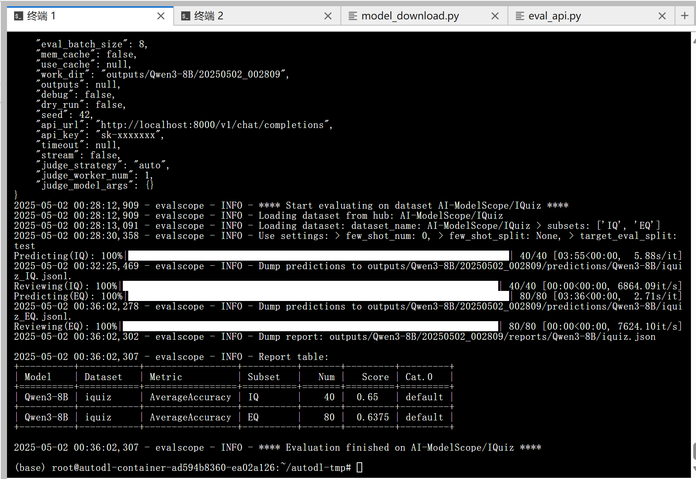
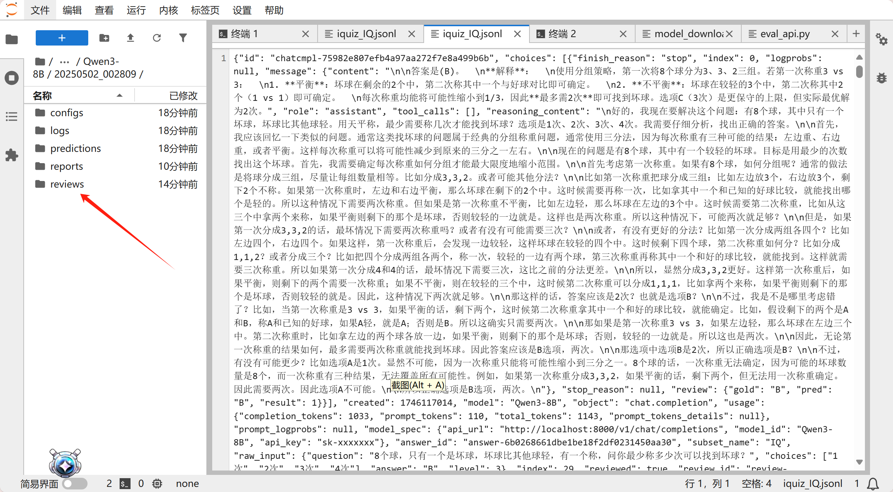
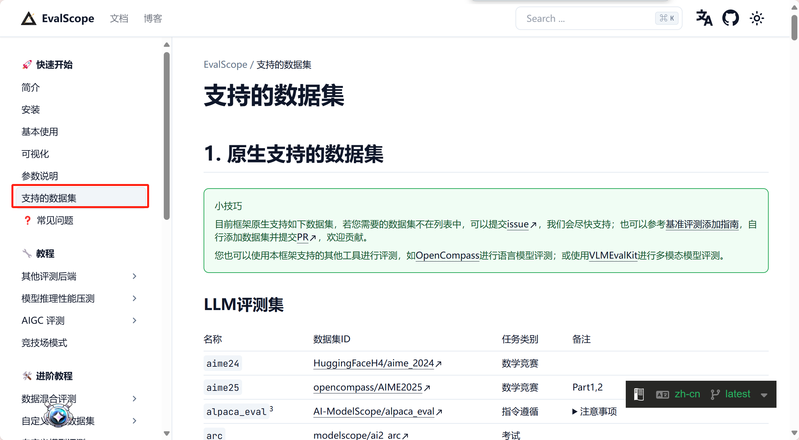
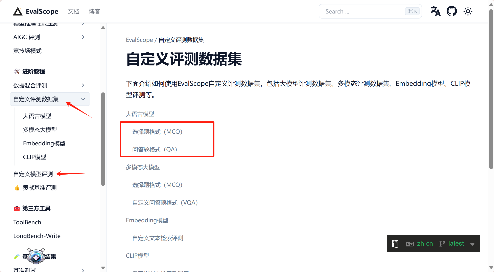

# 04-Qwen3-8B EvalScope智商情商评测
## 大模型评测是什么
大语言模型评测是指对大语言模型（LLM）在多种任务和场景下的性能进行全面评估的过程。评测的目的是衡量模型的通用能力、特定领域表现、效率、鲁棒性、安全性等多方面性能，以便优化模型设计、指导技术选型和推动模型在实际应用中的部署。

评测的主要内容包括以下几个方面：
- 通用能力：评估模型在语言理解、生成、推理等方面的基础能力。
- 特定领域表现：针对特定任务（如数学推理、代码生成、情感分析等）的性能评估。
- 效率与资源消耗：包括模型的训练和推理时间、计算资源需求等。
- 鲁棒性与可靠性：评估模型在面对噪声、对抗攻击或输入扰动时的稳定性。
- 伦理与安全性：检测模型是否会产生有害内容、是否存在偏见或歧视。

EvalScope是魔搭社区官方推出的模型评测与性能基准测试框架，内置多个常用测试基准和评测指标，如MMLU、CMMLU、C-Eval、GSM8K、ARC、HellaSwag、TruthfulQA、MATH和HumanEval等；支持多种类型的模型评测，包括LLM、多模态LLM、embedding模型和reranker模型。EvalScope还适用于多种评测场景，如端到端RAG评测、竞技场模式和模型推理性能压测等。此外，通过ms-swift训练框架的无缝集成，可一键发起评测，实现了模型训练到评测的全链路支持。
官网地址：https://evalscope.readthedocs.io/zh-cn/latest/get_started

# EvalScope评测使用方法

## 环境准备  

本文基础环境如下：

```
----------------
ubuntu 22.04
python 3.12
Cuda  12.4
PyTorch  2.5.1
----------------
```
**pip 安装 EvalScope：**
```
pip install evalscope                # 安装 Native backend (默认)
# 额外选项
pip install evalscope[opencompass]   # 安装 OpenCompass backend
pip install evalscope[vlmeval]       # 安装 VLMEvalKit backend
pip install evalscope[rag]           # 安装 RAGEval backend
pip install evalscope[perf]          # 安装 模型压测模块 依赖
pip install evalscope[all]           # 安装所有 backends (Native, OpenCompass, VLMEvalKit, RAGEval)
```

> 考虑到部分同学配置环境可能会遇到一些问题，我们在 AutoDL 平台准备了 gemma-3-4b-it 的环境镜像，点击下方链接并直接创建 Autodl 示例即可。
> ***https://www.codewithgpu.com/i/datawhalechina/self-llm/self-llm-gemma3***


## 模型评测方法

关于 Qwen3 模型的评测，EvalScope 官方给了一个实践教程供我们参考：https://evalscope.readthedocs.io/zh-cn/latest/best_practice/qwen3.html

下面我们以**智商情商评测**为例，对 Qwen3-8 模型进行评测。

我们将使用 EvalScope 模型评测框架，在 IQuiz 数据集上进行评测，这个数据集中收集了40道 IQ 测试和80道 EQ 测试选择题，其中包括一些经典问题：

- 数字9.8和9.11哪个大？

- 单词 strawberry 和 blueberry 中一共有多少个 r ？

- 刘雨正在休假，突然被要求开车送领导去机场，他正为休假计划的泡汤而懊恼，因此在送领导时，刹车踩得比较用力。在车上，领导突然说：“小刘啊，这不愧是有着悠久历史的西安，我这坐车有一种回到古代坐马车的感觉。” 领导是什么意思？

可以点击[这里](https://modelscope.cn/datasets/AI-ModelScope/IQuiz/dataPeview)看看你能答对多少，再期待一下AI模型的表现吧。

### 步骤一： **创建vLLM服务器**
这里我们参照[第2节教程内容（02-Qwen3-8B-vLLM部署调用）](./02-Qwen3-8B-vLLM%20部署调用.md)，使用vLLM创建兼容 OpenAI API 接口的服务器，然后使用 EvalScope进行评测。当然接入其他的 api 也是可以的。

在终端输入以下命令，即可用 vLLM 部署 Qwen3-8B 模型到一个兼容 OpenAI API 接口的服务器上。
```bash
VLLM_USE_MODELSCOPE=true vllm serve /root/autodl-tmp/Qwen/Qwen3-8B --served-model-name Qwen3-8B --max_model_len 8192 --enable-reasoning --reasoning-parser deepseek_r1
```


### 步骤二： **执行评测**

我们可以使用 EvalScope 命令进行评测，直接在终端输入以下命令：

```bash
evalscope eval \
  --model Qwen3-8B \
  --api-url http://localhost:8000/v1 \
  --api-key EMPTY \
  --eval-type service \
  --eval-batch-size 16 \
  --datasets iquiz \
  --work-dir outputs/Qwen3-8B
```

也可以使用 Python 命令进行评测：

新建eval_api.py文件，并输入以下代码：
```
# 导入执行任务的函数和任务配置类
from evalscope.run import run_task
from evalscope.config import TaskConfig

"""
以下为多个AI服务的API端点地址，用于配置任务：
- siliconflow: https://api.siliconflow.cn/v1/chat/completions
- dashscope: https://dashscope.aliyuncs.com/compatible-mode/v1/chat/completions
- modelscope: https://api-inference.modelscope.cn/v1/chat/completions
- xunfei: https://maas-api.cn-huabei-1.xf-yun.com/v1/chat/completions
"""

# 配置任务参数
task_cfg = TaskConfig(
    model='Qwen3-8B',  # 指定使用的模型
    api_url='http://localhost:8000/v1/chat/completions',  # 指定API端点，这里使用的是ollama默认的api接口
    api_key='sk-xxxxxxx',  # API密钥（需替换为实际密钥，ollama 的api_key）
    eval_type='service',  # 指定评估类型为服务模式
    datasets=['iquiz'],  # 指定使用的数据集(这个测试集可以快速测试模型的智商和情商)
    generation_config={  # 文本生成配置
        'max_tokens': 4096,  # 最大令牌数
        'max_new_tokens': 4096,  # 最大新生成令牌数
        'temperature': 1.0,  # 温度参数，这里设置为1.0，模型的输出随机性较大，所以可能会有些实验误差
    },
    work_dir='outputs/Qwen3-8b',  # 输出目录
)

# 执行任务
run_task(task_cfg=task_cfg)
```

新建一个bash窗口，也就是终端中执行。
控制台运行`python eval_api.py`命令即可。

等待3分钟左右评测就完成啦，控制台输出的结果如下图所示：



实验结果可能有误差，因为在评测任务配置中我们把 temperature 调到了1.0，如果调小一些，可能会得到更精确的结果。
可以看到模型的得分还是不错的，模型评测的文件保存在`/root/autodl-tmp/outputs/Qwen3-8B/20250502_002809/reviews/Qwen3-8B`目录下。



## EvalScope 简介：
- EvalScope 支持多种模型评测backend，包括OpenAI API、OpenCompass、VLMEvalKit、RAGEval等。



- EvalScope 也支持自定义评测任务和数据集，支持多种评测指标。



模型评测对于验证和优化大模型至关重要。通过评测，我们可以全面了解模型的性能、能力边界及潜在问题，确保其在实际应用中的表现符合预期，并推动持续改进。此外，评测还能检测模型的公平性和安全性，提升用户体验，并为不同模型间的对比分析提供客观依据。最终，评测结果为后续版本迭代提供了关键数据支持，保障模型在实际场景中的可靠性和有效性。
